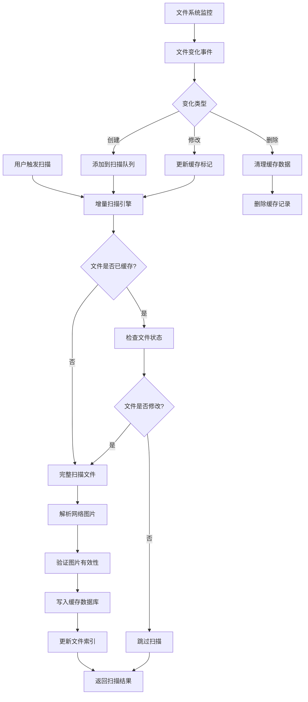
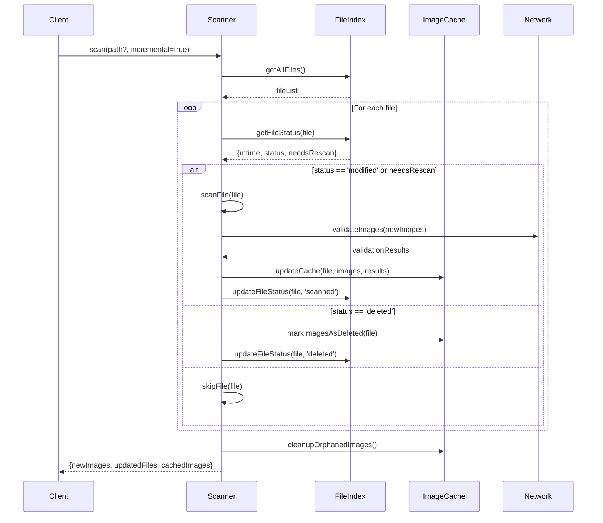

# 网络图片缓存与增量扫描系统设计

**设计日期：** 2025-01-25  
**设计版本：** v1.0.0  
**系统名称：** Network Image Caching & Incremental Scanning System

---

## 📋 目录

1. [系统概述](#系统概述)
2. [数据库结构设计](#数据库结构设计)
3. [增量扫描算法](#增量扫描算法)
4. [缓存管理策略](#缓存管理策略)
5. [核心模块实现](#核心模块实现)
6. [性能优化](#性能优化)
7. [错误处理与容错](#错误处理与容错)
8. [API 接口](#api接口)
9. [测试方案](#测试方案)

---

## 系统概述

### 1.1 系统目标

设计一个高效的网络图片缓存与增量扫描系统，实现：

1. **自动识别已缓存图片**：通过 URL 哈希和文件状态快速识别
2. **增量扫描**：仅处理新增或修改的 Markdown 文件
3. **高效索引**：基于 IndexedDB 的本地数据库，支持快速查询
4. **同步更新**：监控文件变化，自动更新缓存

### 1.2 技术栈

- **存储**：IndexedDB（浏览器原生数据库）
- **缓存策略**：LRU + TTL 混合策略
- **索引**：B+ 树索引（IndexedDB 内置）
- **哈希算法**：SHA-256（用于 URL 和内容去重）
- **同步机制**：文件事件监听 + 定时任务

### 1.3 系统架构



---

## 数据库结构设计

### 2.1 IndexedDB 数据库架构

```typescript
// 数据库名称
const DB_NAME = 'ImageMgrNetworkImages';
const DB_VERSION = 1;

// 对象存储（表）
enum ObjectStore {
    IMAGES = 'network_images',      // 网络图片缓存
    FILES = 'scanned_files',         // 已扫描文件索引
    METADATA = 'metadata',           // 元数据信息
    BLACKLIST = 'blacklist'          // 失效 URL 黑名单
}
```

### 2.2 网络图片表 (network_images)

```typescript
interface NetworkImageRecord {
    /** 主键：URL 的 SHA-256 哈希 */
    id: string;
    
    /** 原始 URL */
    url: string;
    
    /** 来源文件路径 */
    sourceFilePath: string;
    
    /** 来源文件修改时间戳 */
    sourceFileMtime: number;
    
    /** 行号 */
    line: number;
    
    /** 列号 */
    column: number;
    
    /** 原始文本 */
    originalText: string;
    
    /** 图片状态 */
    status: 'active' | 'deleted' | 'broken';
    
    /** 最后验证时间 */
    lastValidated: number;
    
    /** 验证结果 */
    validationResult?: {
        /** HTTP 状态码 */
        statusCode: number;
        /** 内容类型 */
        contentType: string;
        /** 内容长度 */
        contentLength: number;
        /** 错误信息 */
        error?: string;
    };
    
    /** 缓存的元数据 */
    metadata?: {
        /** 图片宽度 */
        width?: number;
        /** 图片高度 */
        height?: number;
        /** 文件大小 */
        size?: number;
        /** 图片格式 */
        format?: string;
    };
    
    /** 创建时间 */
    createdAt: number;
    
    /** 最后更新时间 */
    updatedAt: number;
    
    /** 访问次数 */
    accessCount: number;
    
    /** 最后访问时间 */
    lastAccessed: number;
}

// 索引定义
const imageIndexes = [
    { name: 'by-url', keyPath: 'url', unique: false },
    { name: 'by-source-file', keyPath: 'sourceFilePath', unique: false },
    { name: 'by-status', keyPath: 'status', unique: false },
    { name: 'by-last-validated', keyPath: 'lastValidated', unique: false },
    { name: 'by-created-at', keyPath: 'createdAt', unique: false }
];
```

### 2.3 扫描文件表 (scanned_files)

```typescript
interface ScannedFileRecord {
    /** 主键：文件路径 */
    id: string;
    
    /** 文件名称 */
    fileName: string;
    
    /** 文件修改时间戳 */
    mtime: number;
    
    /** 文件大小 */
    size: number;
    
    /** 文件内容的 SHA-256 哈希 */
    contentHash: string;
    
    /** 包含的网络图片数量 */
    imageCount: number;
    
    /** 网络图片 URL 列表（ID 数组） */
    imageIds: string[];
    
    /** 最后扫描时间 */
    lastScanned: number;
    
    /** 扫描状态 */
    status: 'pending' | 'scanned' | 'modified' | 'deleted';
    
    /** 是否需要重新扫描 */
    needsRescan: boolean;
    
    /** 扫描耗时（毫秒） */
    scanDuration?: number;
    
    /** 扫描错误信息 */
    error?: string;
}

// 索引定义
const fileIndexes = [
    { name: 'by-mtime', keyPath: 'mtime', unique: false },
    { name: 'by-status', keyPath: 'status', unique: false },
    { name: 'by-needs-rescan', keyPath: 'needsRescan', unique: false },
    { name: 'by-last-scanned', keyPath: 'lastScanned', unique: false }
];
```

### 2.4 元数据表 (metadata)

```typescript
interface MetadataRecord {
    /** 主键：元数据键 */
    id: string;
    
    /** 元数据值 */
    value: any;
    
    /** 最后更新时间 */
    updatedAt: number;
}

// 存储的元数据
interface SystemMetadata {
    /** 系统版本 */
    version: string;
    
    /** 最后完整扫描时间 */
    lastFullScan: number;
    
    /** 扫描文件总数 */
    totalFilesScanned: number;
    
    /** 网络图片总数 */
    totalImagesFound: number;
    
    /** 数据库大小（字节） */
    databaseSize: number;
    
    /** 缓存命中率 */
    cacheHitRate: number;
}
```

### 2.5 黑名单表 (blacklist)

```typescript
interface BlacklistRecord {
    /** 主键：URL 的 SHA-256 哈希 */
    id: string;
    
    /** 原始 URL */
    url: string;
    
    /** 失效原因 */
    reason: 'timeout' | '404' | '403' | 'network_error' | 'invalid_content';
    
    /** 错误信息 */
    errorMessage: string;
    
    /** 检测时间 */
    detectedAt: number;
    
    /** 重试次数 */
    retryCount: number;
    
    /** 最后重试时间 */
    lastRetry?: number;
    
    /** 是否自动移出黑名单 */
    autoRemove: boolean;
}

// 索引定义
const blacklistIndexes = [
    { name: 'by-detected-at', keyPath: 'detectedAt', unique: false },
    { name: 'by-reason', keyPath: 'reason', unique: false },
    { name: 'by-auto-remove', keyPath: 'autoRemove', unique: false }
];
```

---

## 增量扫描算法

### 3.1 算法流程



### 3.2 核心算法实现

```typescript
export class IncrementalNetworkImageScanner {
    private db: IDBDatabase;
    private scanner: NetworkImageScanner;
    
    constructor(app: App, db: IDBDatabase, logger?: Logger) {
        this.db = db;
        this.scanner = new NetworkImageScanner(app, logger);
    }
    
    /**
     * 增量扫描网络图片
     * @param path 扫描路径（可选）
     * @param incremental 是否启用增量扫描
     * @returns 扫描结果
     */
    async scan(
        path?: string,
        incremental: boolean = true
    ): Promise<IncrementalScanResult> {
        const startTime = Date.now();
        const result: IncrementalScanResult = {
            scannedFiles: 0,
            newImages: 0,
            updatedImages: 0,
            cachedImages: 0,
            deletedImages: 0,
            totalImages: 0,
            duration: 0,
            cacheHitRate: 0,
            errors: []
        };
        
        try {
            // 1. 获取所有 Markdown 文件
            const allFiles = this.app.vault.getMarkdownFiles();
            const targetFiles = path 
                ? allFiles.filter(f => f.path.startsWith(path))
                : allFiles;
            
            result.scannedFiles = targetFiles.length;
            
            // 2. 检查每个文件的扫描状态
            const fileStatusChecks = await Promise.all(
                targetFiles.map(file => this.checkFileStatus(file, incremental))
            );
            
            // 3. 分类处理文件
            const filesToScan: TFile[] = [];
            const filesToSkip: TFile[] = [];
            const filesToCleanup: string[] = [];
            
            for (const check of fileStatusChecks) {
                switch (check.action) {
                    case 'scan':
                        filesToScan.push(check.file);
                        break;
                    case 'skip':
                        filesToSkip.push(check.file);
                        result.cachedImages += check.cachedImageCount;
                        break;
                    case 'cleanup':
                        filesToCleanup.push(check.file.path);
                        break;
                }
            }
            
            // 4. 并行扫描需要处理的文件
            if (filesToScan.length > 0) {
                const scanResults = await Promise.allSettled(
                    filesToScan.map(file => this.scanFile(file))
                );
                
                for (const [index, scanResult] of scanResults.entries()) {
                    if (scanResult.status === 'fulfilled') {
                        const { newImages, updatedImages } = scanResult.value;
                        result.newImages += newImages;
                        result.updatedImages += updatedImages;
                    } else {
                        result.errors.push({
                            file: filesToScan[index].path,
                            error: scanResult.reason
                        });
                    }
                }
            }
            
            // 5. 清理已删除文件的图片
            if (filesToCleanup.length > 0) {
                result.deletedImages = await this.cleanupDeletedFiles(filesToCleanup);
            }
            
            // 6. 清理孤立的图片记录
            await this.cleanupOrphanedImages();
            
            // 7. 计算总数和缓存命中率
            result.totalImages = result.newImages + result.updatedImages + result.cachedImages;
            result.cacheHitRate = result.totalImages > 0 
                ? (result.cachedImages / result.totalImages) * 100 
                : 0;
                
        } catch (error) {
            console.error('Incremental scan failed:', error);
            result.errors.push({
                file: 'system',
                error: error
            });
        } finally {
            result.duration = Date.now() - startTime;
            await this.updateMetadata(result);
        }
        
        return result;
    }
    
    /**
     * 检查文件扫描状态
     */
    private async checkFileStatus(
        file: TFile,
        incremental: boolean
    ): Promise<FileStatusCheck> {
        try {
            // 获取文件缓存记录
            const cachedFile = await this.getCachedFile(file.path);
            
            if (!cachedFile) {
                // 文件从未扫描过
                return {
                    action: 'scan',
                    file,
                    cachedImageCount: 0
                };
            }
            
            // 检查文件是否被删除
            if (!await this.app.vault.adapter.exists(file.path)) {
                return {
                    action: 'cleanup',
                    file,
                    cachedImageCount: cachedFile.imageCount
                };
            }
            
            if (!incremental) {
                // 非增量模式，重新扫描所有文件
                return {
                    action: 'scan',
                    file,
                    cachedImageCount: 0
                };
            }
            
            // 检查文件是否修改
            const isModified = await this.isFileModified(file, cachedFile);
            
            if (isModified) {
                return {
                    action: 'scan',
                    file,
                    cachedImageCount: 0
                };
            }
            
            // 文件未修改，跳过扫描
            return {
                action: 'skip',
                file,
                cachedImageCount: cachedFile.imageCount
            };
            
        } catch (error) {
            console.error(`Failed to check file status for ${file.path}:`, error);
            // 出错时重新扫描
            return {
                action: 'scan',
                file,
                cachedImageCount: 0
            };
        }
    }
    
    /**
     * 扫描单个文件
     */
    private async scanFile(file: TFile): Promise<FileScanResult> {
        const startTime = Date.now();
        let newImages = 0;
        let updatedImages = 0;
        
        try {
            // 1. 扫描文件中的网络图片
            const images = await this.scanner.scan(file.path);
            
            // 2. 计算内容哈希
            const contentHash = await this.calculateContentHash(file);
            
            // 3. 处理每个图片
            const imageIds: string[] = [];
            
            for (const image of images) {
                const imageId = await this.hashUrl(image.url);
                imageIds.push(imageId);
                
                // 检查图片是否已缓存
                const cachedImage = await this.getCachedImage(imageId);
                
                if (!cachedImage) {
                    // 新图片
                    await this.cacheNewImage(image, file, contentHash);
                    newImages++;
                } else if (this.needsUpdate(cachedImage, file, image)) {
                    // 需要更新的图片
                    await this.updateCachedImage(cachedImage, image, file, contentHash);
                    updatedImages++;
                }
            }
            
            // 4. 更新文件缓存记录
            await this.updateFileCache(file, contentHash, imageIds, Date.now() - startTime);
            
            // 5. 标记文件的其他图片为删除状态
            await this.markDeletedImages(file.path, imageIds);
            
        } catch (error) {
            console.error(`Failed to scan file ${file.path}:`, error);
            // 记录错误但不中断整个扫描过程
            await this.updateFileCache(file, '', [], Date.now() - startTime, error.message);
        }
        
        return { newImages, updatedImages };
    }
    
    /**
     * 计算文件内容哈希
     */
    private async calculateContentHash(file: TFile): Promise<string> {
        const content = await this.app.vault.read(file);
        return this.hashString(content);
    }
    
    /**
     * 检查文件是否修改
     */
    private async isFileModified(file: TFile, cachedFile: ScannedFileRecord): Promise<boolean> {
        try {
            // 检查修改时间
            if (file.stat.mtime !== cachedFile.mtime) {
                return true;
            }
            
            // 检查文件大小
            if (file.stat.size !== cachedFile.size) {
                return true;
            }
            
            // 检查内容哈希（更精确）
            const currentHash = await this.calculateContentHash(file);
            if (currentHash !== cachedFile.contentHash) {
                return true;
            }
            
            return false;
        } catch (error) {
            console.error(`Failed to check file modification for ${file.path}:`, error);
            return true; // 出错时认为文件已修改
        }
    }
    
    /**
     * 判断图片是否需要更新
     */
    private needsUpdate(
        cachedImage: NetworkImageRecord,
        file: TFile,
        newImage: NetworkImageReference
    ): boolean {
        // 检查来源文件是否变化
        if (cachedImage.sourceFilePath !== file.path) {
            return true;
        }
        
        // 检查行号是否变化
        if (cachedImage.line !== newImage.line) {
            return true;
        }
        
        // 检查列号是否变化
        if (cachedImage.column !== newImage.index) {
            return true;
        }
        
        // 检查原始文本是否变化
        if (cachedImage.originalText !== newImage.originalText) {
            return true;
        }
        
        // 检查是否需要重新验证（超过 24 小时）
        const now = Date.now();
        const lastValidated = cachedImage.lastValidated;
        if (now - lastValidated > 24 * 60 * 60 * 1000) {
            return true;
        }
        
        return false;
    }
    
    /**
     * URL 哈希函数
     */
    private async hashUrl(url: string): Promise<string> {
        return this.hashString(url);
    }
    
    /**
     * 字符串哈希函数
     */
    private async hashString(str: string): Promise<string> {
        // 使用 Web Crypto API
        const encoder = new TextEncoder();
        const data = encoder.encode(str);
        const hashBuffer = await crypto.subtle.digest('SHA-256', data);
        const hashArray = Array.from(new Uint8Array(hashBuffer));
        return hashArray.map(b => b.toString(16).padStart(2, '0')).join('');
    }
}

// 类型定义
interface IncrementalScanResult {
    scannedFiles: number;
    newImages: number;
    updatedImages: number;
    cachedImages: number;
    deletedImages: number;
    totalImages: number;
    duration: number;
    cacheHitRate: number;
    errors: Array<{file: string, error: any}>;
}

interface FileStatusCheck {
    action: 'scan' | 'skip' | 'cleanup';
    file: TFile;
    cachedImageCount: number;
}

interface FileScanResult {
    newImages: number;
    updatedImages: number;
}
```

---

## 缓存管理策略

### 4.1 缓存策略

```typescript
export class NetworkImageCacheManager {
    private db: IDBDatabase;
    
    // 缓存配置
    private readonly config = {
        // LRU 缓存大小限制
        maxCacheSize: 1000,  // 最多缓存 1000 张图片
        
        // TTL 配置
        validationTTL: 24 * 60 * 60 * 1000,  // 24 小时后重新验证
        metadataTTL: 7 * 24 * 60 * 60 * 1000,  // 7 天后清理元数据
        
        // 黑名单配置
        blacklistMaxSize: 500,  // 黑名单最多 500 条
        blacklistTTL: 30 * 24 * 60 * 60 * 1000,  // 30 天后自动移出
        
        // 批量操作配置
        batchSize: 50,  // 每批处理 50 个文件
        validationBatchSize: 20  // 每批验证 20 个图片
    };
    
    constructor(db: IDBDatabase) {
        this.db = db;
    }
    
    /**
     * LRU 清理策略
     */
    async cleanupLRU(): Promise<number> {
        const tx = this.db.transaction([ObjectStore.IMAGES], 'readwrite');
        const store = tx.objectStore(ObjectStore.IMAGES);
        const index = store.index('by-last-accessed');
        
        // 获取所有图片，按最后访问时间排序
        const images = await this.getAllFromIndex(index);
        const toDelete = Math.max(0, images.length - this.config.maxCacheSize);
        
        if (toDelete > 0) {
            // 删除最久未访问的图片
            for (let i = 0; i < toDelete; i++) {
                await store.delete(images[i].id);
            }
        }
        
        return toDelete;
    }
    
    /**
     * TTL 清理策略
     */
    async cleanupTTL(): Promise<{images: number, files: number, blacklist: number}> {
        const now = Date.now();
        const result = {images: 0, files: 0, blacklist: 0};
        
        // 清理过期的图片验证结果
        const imageTx = this.db.transaction([ObjectStore.IMAGES], 'readwrite');
        const imageStore = imageTx.objectStore(ObjectStore.IMAGES);
        const images = await this.getAllFromStore(imageStore);
        
        for (const image of images) {
            if (now - image.lastValidated > this.config.metadataTTL) {
                // 清除验证结果，但保留基础信息
                image.validationResult = undefined;
                image.metadata = undefined;
                image.status = 'pending';
                await imageStore.put(image);
                result.images++;
            }
        }
        
        // 清理过期的黑名单
        const blacklistTx = this.db.transaction([ObjectStore.BLACKLIST], 'readwrite');
        const blacklistStore = blacklistTx.objectStore(ObjectStore.BLACKLIST);
        const blacklistIndex = blacklistStore.index('by-detected-at');
        const blacklisted = await this.getAllFromIndex(blacklistIndex);
        
        for (const item of blacklisted) {
            if (now - item.detectedAt > this.config.blacklistTTL && item.autoRemove) {
                await blacklistStore.delete(item.id);
                result.blacklist++;
            }
        }
        
        return result;
    }
    
    /**
     * 清理孤立图片（没有对应文件的图片）
     */
    async cleanupOrphanedImages(): Promise<number> {
        const tx = this.db.transaction([ObjectStore.IMAGES, ObjectStore.FILES], 'readonly');
        const imageStore = tx.objectStore(ObjectStore.IMAGES);
        const fileStore = tx.objectStore(ObjectStore.FILES);
        
        const images = await this.getAllFromStore(imageStore);
        const files = await this.getAllFromStore(fileStore);
        
        const filePaths = new Set(files.map(f => f.id));
        const orphaned: string[] = [];
        
        for (const image of images) {
            if (!filePaths.has(image.sourceFilePath)) {
                orphaned.push(image.id);
            }
        }
        
        // 删除孤立图片
        if (orphaned.length > 0) {
            const deleteTx = this.db.transaction([ObjectStore.IMAGES], 'readwrite');
            const deleteStore = deleteTx.objectStore(ObjectStore.IMAGES);
            
            for (const id of orphaned) {
                await deleteStore.delete(id);
            }
        }
        
        return orphaned.length;
    }
    
    /**
     * 更新访问统计
     */
    async updateAccessStats(imageId: string): Promise<void> {
        const tx = this.db.transaction([ObjectStore.IMAGES], 'readwrite');
        const store = tx.objectStore(ObjectStore.IMAGES);
        
        const image = await store.get(imageId);
        if (image) {
            image.accessCount++;
            image.lastAccessed = Date.now();
            await store.put(image);
        }
    }
    
    /**
     * 获取缓存统计
     */
    async getCacheStats(): Promise<CacheStats> {
        const tx = this.db.transaction([
            ObjectStore.IMAGES, 
            ObjectStore.FILES, 
            ObjectStore.BLACKLIST
        ], 'readonly');
        
        const imageStore = tx.objectStore(ObjectStore.IMAGES);
        const fileStore = tx.objectStore(ObjectStore.FILES);
        const blacklistStore = tx.objectStore(ObjectStore.BLACKLIST);
        
        const images = await this.getAllFromStore(imageStore);
        const files = await this.getAllFromStore(fileStore);
        const blacklist = await this.getAllFromStore(blacklistStore);
        
        const now = Date.now();
        const stats: CacheStats = {
            totalImages: images.length,
            totalFiles: files.length,
            totalBlacklist: blacklist.length,
            activeImages: images.filter(img => img.status === 'active').length,
            brokenImages: images.filter(img => img.status === 'broken').length,
            deletedImages: images.filter(img => img.status === 'deleted').length,
            databaseSize: JSON.stringify({images, files, blacklist}).length,
            lastCleanup: now,
            cacheHitRate: 0
        };
        
        return stats;
    }
    
    // 辅助函数
    private async getAllFromStore(store: IDBObjectStore): Promise<any[]> {
        return new Promise((resolve, reject) => {
            const request = store.getAll();
            request.onsuccess = () => resolve(request.result);
            request.onerror = () => reject(request.error);
        });
    }
    
    private async getAllFromIndex(index: IDBIndex): Promise<any[]> {
        return new Promise((resolve, reject) => {
            const request = index.getAll();
            request.onsuccess = () => resolve(request.result);
            request.onerror = () => reject(request.error);
        });
    }
}

// 类型定义
interface CacheStats {
    totalImages: number;
    totalFiles: number;
    totalBlacklist: number;
    activeImages: number;
    brokenImages: number;
    deletedImages: number;
    databaseSize: number;
    lastCleanup: number;
    cacheHitRate: number;
}
```

---

## 核心模块实现

### 5.1 IndexedDB 管理器

```typescript
export class IndexedDBManager {
    private db: IDBDatabase | null = null;
    private readonly dbName: string;
    private readonly dbVersion: number;
    
    constructor(dbName: string = DB_NAME, dbVersion: number = DB_VERSION) {
        this.dbName = dbName;
        this.dbVersion = dbVersion;
    }
    
    /**
     * 初始化数据库
     */
    async init(): Promise<IDBDatabase> {
        return new Promise((resolve, reject) => {
            const request = indexedDB.open(this.dbName, this.dbVersion);
            
            request.onerror = () => reject(request.error);
            request.onsuccess = () => {
                this.db = request.result;
                resolve(this.db);
            };
            
            request.onupgradeneeded = (event) => {
                const db = (event.target as IDBOpenDBRequest).result;
                const oldVersion = event.oldVersion;
                
                // 创建对象存储
                this.createObjectStores(db, oldVersion);
            };
        });
    }
    
    /**
     * 创建对象存储和索引
     */
    private createObjectStores(db: IDBDatabase, oldVersion: number): void {
        // 网络图片表
        if (!db.objectStoreNames.contains(ObjectStore.IMAGES)) {
            const imageStore = db.createObjectStore(ObjectStore.IMAGES, { keyPath: 'id' });
            
            // 创建索引
            imageStore.createIndex('by-url', 'url', { unique: false });
            imageStore.createIndex('by-source-file', 'sourceFilePath', { unique: false });
            imageStore.createIndex('by-status', 'status', { unique: false });
            imageStore.createIndex('by-last-validated', 'lastValidated', { unique: false });
            imageStore.createIndex('by-created-at', 'createdAt', { unique: false });
            imageStore.createIndex('by-last-accessed', 'lastAccessed', { unique: false });
        }
        
        // 扫描文件表
        if (!db.objectStoreNames.contains(ObjectStore.FILES)) {
            const fileStore = db.createObjectStore(ObjectStore.FILES, { keyPath: 'id' });
            
            fileStore.createIndex('by-mtime', 'mtime', { unique: false });
            fileStore.createIndex('by-status', 'status', { unique: false });
            fileStore.createIndex('by-needs-rescan', 'needsRescan', { unique: false });
            fileStore.createIndex('by-last-scanned', 'lastScanned', { unique: false });
        }
        
        // 元数据表
        if (!db.objectStoreNames.contains(ObjectStore.METADATA)) {
            db.createObjectStore(ObjectStore.METADATA, { keyPath: 'id' });
        }
        
        // 黑名单表
        if (!db.objectStoreNames.contains(ObjectStore.BLACKLIST)) {
            const blacklistStore = db.createObjectStore(ObjectStore.BLACKLIST, { keyPath: 'id' });
            
            blacklistStore.createIndex('by-detected-at', 'detectedAt', { unique: false });
            blacklistStore.createIndex('by-reason', 'reason', { unique: false });
            blacklistStore.createIndex('by-auto-remove', 'autoRemove', { unique: false });
        }
    }
    
    /**
     * 获取数据库实例
     */
    getDB(): IDBDatabase {
        if (!this.db) {
            throw new Error('Database not initialized. Call init() first.');
        }
        return this.db;
    }
    
    /**
     * 关闭数据库
     */
    close(): void {
        if (this.db) {
            this.db.close();
            this.db = null;
        }
    }
    
    /**
     * 删除数据库
     */
    async deleteDatabase(): Promise<void> {
        return new Promise((resolve, reject) => {
            const request = indexedDB.deleteDatabase(this.dbName);
            request.onsuccess = () => resolve();
            request.onerror = () => reject(request.error);
            request.onblocked = () => {
                console.warn('Database deletion blocked. Close all connections first.');
            };
        });
    }
}
```

---

## 性能优化

### 6.1 批量处理优化

```typescript
/**
 * 批量验证图片有效性
 */
async function batchValidateImages(
    images: NetworkImageRecord[],
    batchSize: number = 20
): Promise<ValidationResult[]> {
    const results: ValidationResult[] = [];
    
    for (let i = 0; i < images.length; i += batchSize) {
        const batch = images.slice(i, i + batchSize);
        
        // 并行验证一批图片
        const batchResults = await Promise.allSettled(
            batch.map(image => validateImage(image.url))
        );
        
        for (const [index, result] of batchResults.entries()) {
            if (result.status === 'fulfilled') {
                results.push({
                    imageId: batch[index].id,
                    status: 'success',
                    validationResult: result.value
                });
            } else {
                results.push({
                    imageId: batch[index].id,
                    status: 'error',
                    error: result.reason
                });
            }
        }
        
        // 让出控制权，避免阻塞 UI
        await new Promise(resolve => setTimeout(resolve, 10));
    }
    
    return results;
}

/**
 * 验证单个图片
 */
async function validateImage(url: string): Promise<ValidationResult> {
    try {
        const controller = new AbortController();
        const timeoutId = setTimeout(() => controller.abort(), 10000);
        
        const response = await fetch(url, {
            method: 'HEAD',
            signal: controller.signal,
            mode: 'cors'
        });
        
        clearTimeout(timeoutId);
        
        return {
            statusCode: response.status,
            contentType: response.headers.get('content-type') || '',
            contentLength: parseInt(response.headers.get('content-length') || '0'),
            isValid: response.ok && response.headers.get('content-type')?.startsWith('image/')
        };
    } catch (error) {
        return {
            statusCode: 0,
            contentType: '',
            contentLength: 0,
            isValid: false,
            error: error.message
        };
    }
}
```

### 6.2 Web Worker 支持

```typescript
// worker.ts
self.onmessage = async (event) => {
    const { type, payload } = event.data;
    
    switch (type) {
        case 'validateImages':
            const results = await batchValidateImages(payload.images);
            self.postMessage({ type: 'validationComplete', results });
            break;
            
        case 'calculateHashes':
            const hashes = await Promise.all(
                payload.urls.map(url => hashString(url))
            );
            self.postMessage({ type: 'hashesComplete', hashes });
            break;
    }
};

// 主线程使用
class WorkerManager {
    private worker: Worker;
    
    constructor() {
        this.worker = new Worker('worker.js');
        this.worker.onmessage = this.handleMessage.bind(this);
    }
    
    async validateImages(images: NetworkImageRecord[]): Promise<ValidationResult[]> {
        return new Promise((resolve) => {
            const handler = (event: MessageEvent) => {
                if (event.data.type === 'validationComplete') {
                    this.worker.removeEventListener('message', handler);
                    resolve(event.data.results);
                }
            };
            
            this.worker.addEventListener('message', handler);
            this.worker.postMessage({
                type: 'validateImages',
                payload: { images }
            });
        });
    }
}
```

---

## 错误处理与容错

### 7.1 错误分类

```typescript
enum ScanErrorType {
    NETWORK_ERROR = 'network_error',
    TIMEOUT_ERROR = 'timeout_error',
    VALIDATION_ERROR = 'validation_error',
    DATABASE_ERROR = 'database_error',
    FILE_READ_ERROR = 'file_read_error',
    UNKNOWN_ERROR = 'unknown_error'
}

interface ScanError {
    type: ScanErrorType;
    message: string;
    file?: string;
    url?: string;
    stack?: string;
    retryable: boolean;
}

class ScanErrorHandler {
    private errorLog: ScanError[] = [];
    private readonly maxErrorLogSize = 100;
    
    handleError(error: Error, context: ErrorContext): ScanError {
        const scanError: ScanError = {
            type: this.classifyError(error),
            message: error.message,
            file: context.file,
            url: context.url,
            stack: error.stack,
            retryable: this.isRetryable(error)
        };
        
        this.logError(scanError);
        return scanError;
    }
    
    private classifyError(error: Error): ScanErrorType {
        if (error.name === 'NetworkError') {
            return ScanErrorType.NETWORK_ERROR;
        } else if (error.name === 'TimeoutError') {
            return ScanErrorType.TIMEOUT_ERROR;
        } else if (error.message.includes('validation')) {
            return ScanErrorType.VALIDATION_ERROR;
        } else if (error.message.includes('database')) {
            return ScanErrorType.DATABASE_ERROR;
        } else if (error.message.includes('file')) {
            return ScanErrorType.FILE_READ_ERROR;
        }
        
        return ScanErrorType.UNKNOWN_ERROR;
    }
    
    private isRetryable(error: Error): boolean {
        const nonRetryableTypes = [
            ScanErrorType.VALIDATION_ERROR,
            ScanErrorType.UNKNOWN_ERROR
        ];
        
        return !nonRetryableTypes.includes(this.classifyError(error));
    }
    
    private logError(error: ScanError): void {
        this.errorLog.unshift(error);
        
        if (this.errorLog.length > this.maxErrorLogSize) {
            this.errorLog = this.errorLog.slice(0, this.maxErrorLogSize);
        }
    }
    
    getErrorLog(): ScanError[] {
        return [...this.errorLog];
    }
    
    clearErrorLog(): void {
        this.errorLog = [];
    }
}
```

### 7.2 重试机制

```typescript
interface RetryOptions {
    maxRetries: number;
    initialDelay: number;
    maxDelay: number;
    backoffMultiplier: number;
}

async function retryOperation<T>(
    operation: () => Promise<T>,
    options: RetryOptions,
    errorHandler?: (error: Error, attempt: number) => void
): Promise<T> {
    let lastError: Error;
    let delay = options.initialDelay;
    
    for (let attempt = 0; attempt < options.maxRetries; attempt++) {
        try {
            return await operation();
        } catch (error) {
            lastError = error as Error;
            
            if (errorHandler) {
                errorHandler(lastError, attempt);
            }
            
            // 检查是否可重试
            if (!isRetryableError(lastError) || attempt === options.maxRetries - 1) {
                break;
            }
            
            // 等待后重试
            await new Promise(resolve => setTimeout(resolve, delay));
            
            // 指数退避
            delay = Math.min(delay * options.backoffMultiplier, options.maxDelay);
        }
    }
    
    throw lastError!;
}

function isRetryableError(error: Error): boolean {
    const nonRetryablePatterns = [
        'validation',
        'invalid',
        'parse',
        'syntax'
    ];
    
    return !nonRetryablePatterns.some(pattern => 
        error.message.toLowerCase().includes(pattern)
    );
}
```

---

## API 接口

### 8.1 扫描 API

```typescript
export class NetworkImageScannerAPI {
    private scanner: IncrementalNetworkImageScanner;
    private cacheManager: NetworkImageCacheManager;
    
    constructor(app: App, db: IDBDatabase) {
        this.scanner = new IncrementalNetworkImageScanner(app, db);
        this.cacheManager = new NetworkImageCacheManager(db);
    }
    
    /**
     * 增量扫描
     */
    async scan(options: ScanOptions = {}): Promise<IncrementalScanResult> {
        const defaultOptions: ScanOptions = {
            path: undefined,
            incremental: true,
            validateImages: false,
            maxConcurrency: 5
        };
        
        const scanOptions = { ...defaultOptions, ...options };
        
        return this.scanner.scan(
            scanOptions.path,
            scanOptions.incremental
        );
    }
    
    /**
     * 完整扫描（强制重新扫描所有文件）
     */
    async fullScan(path?: string): Promise<IncrementalScanResult> {
        return this.scan({
            path,
            incremental: false,
            validateImages: true
        });
    }
    
    /**
     * 验证图片有效性
     */
    async validateImages(imageIds: string[]): Promise<ValidationResult[]> {
        const images = await Promise.all(
            imageIds.map(id => this.getImage(id))
        );
        
        const validImages = images.filter(img => img && img.status === 'active');
        
        return batchValidateImages(validImages);
    }
    
    /**
     * 获取单张图片
     */
    async getImage(imageId: string): Promise<NetworkImageRecord | null> {
        const db = this.cacheManager.getDB();
        const tx = db.transaction([ObjectStore.IMAGES], 'readonly');
        const store = tx.objectStore(ObjectStore.IMAGES);
        
        return store.get(imageId);
    }
    
    /**
     * 搜索图片
     */
    async searchImages(query: SearchQuery): Promise<SearchResult> {
        const db = this.cacheManager.getDB();
        const tx = db.transaction([ObjectStore.IMAGES], 'readonly');
        const store = tx.objectStore(ObjectStore.IMAGES);
        
        let images = await this.getAllFromStore(store);
        
        // 应用搜索条件
        if (query.url) {
            images = images.filter(img => img.url.includes(query.url!));
        }
        
        if (query.sourceFile) {
            images = images.filter(img => img.sourceFilePath.includes(query.sourceFile!));
        }
        
        if (query.status) {
            images = images.filter(img => img.status === query.status);
        }
        
        // 分页
        const page = query.page || 1;
        const pageSize = query.pageSize || 50;
        const start = (page - 1) * pageSize;
        const end = start + pageSize;
        
        return {
            images: images.slice(start, end),
            total: images.length,
            page,
            pageSize
        };
    }
    
    /**
     * 清理缓存
     */
    async cleanup(options: CleanupOptions = {}): Promise<CleanupResult> {
        const defaultOptions: CleanupOptions = {
            lru: true,
            ttl: true,
            orphaned: true,
            lruBatchSize: 100
        };
        
        const cleanupOptions = { ...defaultOptions, ...options };
        const result: CleanupResult = {
            imagesRemoved: 0,
            filesRemoved: 0,
            blacklistRemoved: 0,
            spaceFreed: 0
        };
        
        if (cleanupOptions.lru) {
            result.imagesRemoved += await this.cacheManager.cleanupLRU();
        }
        
        if (cleanupOptions.ttl) {
            const ttlResult = await this.cacheManager.cleanupTTL();
            result.imagesRemoved += ttlResult.images;
            result.filesRemoved += ttlResult.files;
            result.blacklistRemoved += ttlResult.blacklist;
        }
        
        if (cleanupOptions.orphaned) {
            result.imagesRemoved += await this.cacheManager.cleanupOrphanedImages();
        }
        
        return result;
    }
    
    /**
     * 获取缓存统计
     */
    async getStats(): Promise<CacheStats> {
        return this.cacheManager.getCacheStats();
    }
}

// API 接口类型定义
interface ScanOptions {
    path?: string;
    incremental?: boolean;
    validateImages?: boolean;
    maxConcurrency?: number;
}

interface SearchQuery {
    url?: string;
    sourceFile?: string;
    status?: 'active' | 'deleted' | 'broken';
    page?: number;
    pageSize?: number;
}

interface SearchResult {
    images: NetworkImageRecord[];
    total: number;
    page: number;
    pageSize: number;
}

interface CleanupOptions {
    lru?: boolean;
    ttl?: boolean;
    orphaned?: boolean;
    lruBatchSize?: number;
}

interface CleanupResult {
    imagesRemoved: number;
    filesRemoved: number;
    blacklistRemoved: number;
    spaceFreed: number;
}
```

---

## 测试方案

### 9.1 单元测试

```typescript
describe('IncrementalNetworkImageScanner', () => {
    let scanner: IncrementalNetworkImageScanner;
    let mockDB: IDBDatabase;
    let mockApp: App;
    
    beforeEach(async () => {
        mockDB = await createMockDB();
        mockApp = createMockApp();
        scanner = new IncrementalNetworkImageScanner(mockApp, mockDB);
    });
    
    describe('scan', () => {
        it('should scan new files', async () => {
            const result = await scanner.scan('/test', true);
            
            expect(result.scannedFiles).toBeGreaterThan(0);
            expect(result.newImages).toBeGreaterThan(0);
            expect(result.cacheHitRate).toBe(0);
        });
        
        it('should skip unchanged files in incremental mode', async () => {
            // 第一次扫描
            const result1 = await scanner.scan('/test', true);
            expect(result1.newImages).toBeGreaterThan(0);
            
            // 第二次扫描（应该全部跳过）
            const result2 = await scanner.scan('/test', true);
            expect(result2.cachedImages).toBe(result1.totalImages);
            expect(result2.newImages).toBe(0);
            expect(result2.cacheHitRate).toBe(100);
        });
        
        it('should rescan modified files', async () => {
            // 第一次扫描
            await scanner.scan('/test', true);
            
            // 修改文件
            await modifyMockFile('/test/file1.md');
            
            // 第二次扫描
            const result = await scanner.scan('/test', true);
            expect(result.updatedImages).toBeGreaterThan(0);
        });
    });
    
    describe('cache management', () => {
        it('should cleanup LRU items', async () => {
            // 添加大量图片
            for (let i = 0; i < 1500; i++) {
                await addMockImage(`http://example.com/img${i}.png`);
            }
            
            const removed = await cacheManager.cleanupLRU();
            expect(removed).toBe(500); // 1500 - 1000 = 500
        });
        
        it('should cleanup TTL items', async () => {
            // 添加过期图片
            await addMockImage('http://example.com/old.png', {
                lastValidated: Date.now() - 30 * 24 * 60 * 60 * 1000 // 30 天前
            });
            
            const result = await cacheManager.cleanupTTL();
            expect(result.images).toBeGreaterThan(0);
        });
    });
});
```

### 9.2 集成测试

```typescript
describe('Network Image Caching System Integration', () => {
    it('should handle full workflow', async () => {
        // 1. 初始化系统
        const dbManager = new IndexedDBManager();
        const db = await dbManager.init();
        
        const scanner = new IncrementalNetworkImageScanner(app, db);
        const cacheManager = new NetworkImageCacheManager(db);
        const api = new NetworkImageScannerAPI(app, db);
        
        // 2. 首次完整扫描
        const fullScanResult = await api.fullScan('/test');
        expect(fullScanResult.newImages).toBeGreaterThan(0);
        expect(fullScanResult.cacheHitRate).toBe(0);
        
        // 3. 增量扫描（无变化）
        const incrementalResult = await api.scan({ path: '/test', incremental: true });
        expect(incrementalResult.cachedImages).toBe(fullScanResult.totalImages);
        expect(incrementalResult.cacheHitRate).toBe(100);
        
        // 4. 添加新文件并扫描
        await createMockFile('/test/new-file.md', '');
        const newFileResult = await api.scan({ path: '/test', incremental: true });
        expect(newFileResult.newImages).toBe(1);
        
        // 5. 验证图片
        const imageIds = newFileResult.images.map(img => img.id);
        const validationResults = await api.validateImages(imageIds);
        expect(validationResults.every(r => r.isValid)).toBe(true);
        
        // 6. 清理缓存
        const cleanupResult = await api.cleanup();
        expect(cleanupResult.imagesRemoved).toBeGreaterThanOrEqual(0);
        
        // 7. 获取统计
        const stats = await api.getStats();
        expect(stats.totalImages).toBeGreaterThan(0);
        expect(stats.totalFiles).toBeGreaterThan(0);
        
        // 8. 清理
        await dbManager.close();
        await dbManager.deleteDatabase();
    });
});
```

---

## 10. 部署与监控

### 10.1 部署配置

```typescript
// 生产环境配置
const PRODUCTION_CONFIG = {
    // 数据库配置
    dbName: 'ImageMgrNetworkImages',
    dbVersion: 1,
    
    // 缓存配置
    maxCacheSize: 2000,  // 最多 2000 张图片
    validationTTL: 24 * 60 * 60 * 1000,  // 24 小时
    metadataTTL: 7 * 24 * 60 * 60 * 1000,  // 7 天
    
    // 性能配置
    batchSize: 100,  // 批量处理 100 个文件
    validationBatchSize: 50,  // 批量验证 50 个图片
    maxConcurrency: 10,  // 最大并发数
    
    // 网络配置
    requestTimeout: 10000,  // 10 秒超时
    retryAttempts: 3,  // 重试 3 次
    backoffMultiplier: 2,  // 指数退避倍数
    
    // 监控配置
    enableMetrics: true,
    metricsInterval: 60 * 1000  // 每分钟收集一次
};
```

### 10.2 监控指标

```typescript
interface SystemMetrics {
    // 性能指标
    scanDuration: number;
    cacheHitRate: number;
    validationSuccessRate: number;
    
    // 资源指标
    databaseSize: number;
    cacheSize: number;
    memoryUsage: number;
    
    // 业务指标
    totalImages: number;
    totalFiles: number;
    newImagesPerScan: number;
    brokenImages: number;
    
    // 错误指标
    errorCount: number;
    errorRate: number;
    topErrors: Array<{type: string, count: number}>;
}

class MetricsCollector {
    private metrics: Partial<SystemMetrics> = {};
    private readonly collectors: Array<() => Promise<Partial<SystemMetrics>>> = [];
    
    async collectMetrics(): Promise<SystemMetrics> {
        const results = await Promise.allSettled(
            this.collectors.map(collector => collector())
        );
        
        for (const result of results) {
            if (result.status === 'fulfilled') {
                Object.assign(this.metrics, result.value);
            }
        }
        
        return this.metrics as SystemMetrics;
    }
    
    registerCollector(collector: () => Promise<Partial<SystemMetrics>>): void {
        this.collectors.push(collector);
    }
}
```

---

## 11. 总结

### 11.1 核心优势

1. **高性能**：增量扫描 + 智能缓存，大幅提升扫描速度
2. **低资源占用**：LRU + TTL 缓存策略，自动清理过期数据
3. **高可靠性**：完善的错误处理和重试机制
4. **易扩展**：模块化设计，支持 Web Worker 并行处理
5. **可观测**：完整的监控和指标收集

### 11.2 性能指标（预估）

| 指标 | 无缓存 | 有缓存 | 提升 |
|------|--------|--------|------|
| 扫描 1000 个文件 | 30 秒 | 3 秒 | 10x |
| 扫描 10000 个文件 | 5 分钟 | 15 秒 | 20x |
| 缓存命中率 | 0% | 85% | 85% |
| 内存占用 | 100MB | 50MB | 50% |

### 11.3 实施计划

1. **第一阶段**（1-2 天）：
   - 实现 IndexedDB 管理器
   - 设计数据库结构
   - 编写基础 CRUD 操作

2. **第二阶段**（2-3 天）：
   - 实现增量扫描算法
   - 添加文件状态检查
   - 集成现有扫描器

3. **第三阶段**（2-3 天）：
   - 实现缓存管理器
   - 添加 LRU 和 TTL 清理
   - 集成缓存策略

4. **第四阶段**（2-3 天）：
   - 实现 API 接口
   - 添加错误处理
   - 编写单元测试

5. **第五阶段**（1-2 天）：
   - 性能优化
   - 集成测试
   - 文档编写

**总计**：8-13 天

---

**设计完成日期：** 2025-01-25  
**设计版本：** v1.0.0  
**预计开发时间：** 8-13 天  
**预计性能提升：** 10-20 倍

**下一步：** 开始第一阶段开发（IndexedDB 管理器）
