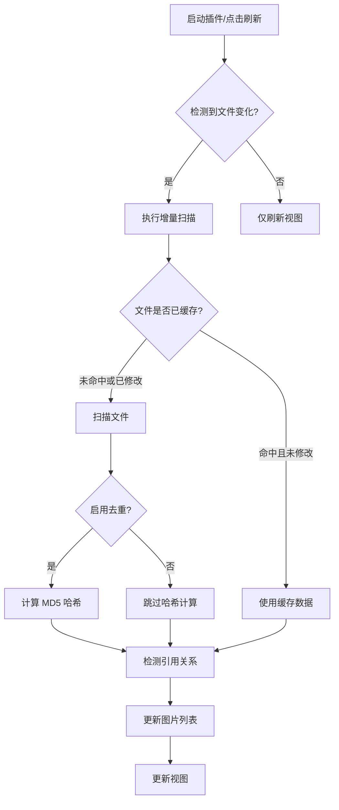

# ImageMgr

<p align="center">
  <strong>🖼️ 强大的 Obsidian 图片管理插件</strong>
</p>

<p align="center">
  <a href="https://github.com/Coeris/Obsidian-ImageMgr/releases">
    
  </a>
  <a href="https://github.com/Coeris/Obsidian-ImageMgr/blob/main/LICENSE">
    
  </a>
  <a href="https://obsidian.md/">
    
  </a>
</p>

<p align="center">
  <a href="./README-EN.md">English</a> | 简体中文
</p>

---

ImageMgr 是一个功能丰富的 Obsidian 图片管理插件，帮助您轻松管理仓库中的所有图片文件。支持智能扫描、批量重命名、MD5 去重、引用追踪、云端图片管理、链接格式转换、空链接检测、回收站、操作日志、移动端适配等功能。

## ✨ 功能亮点

| 功能 | 描述 |
|------|------|
| 📸 **智能扫描** | 自动扫描仓库中的所有图片（PNG、JPG、GIF、WEBP、SVG、BMP），支持增量扫描和缓存优化 |
| 🌩️ **云端图片** | 扫描和管理网络图片链接，支持代理加载和云端图片标识 |
| 🔍 **搜索筛选** | 实时搜索、多种排序方式、按类型/位置/锁定状态筛选，支持倒序清除 |
| 📁 **智能分组** | 按文件夹、类型、引用状态、位置类型分组，自定义分组管理 |
| 🏷️ **批量重命名** | 支持 `{index}`、`{name}` 占位符，根据引用笔记自动命名 |
| 🔗 **引用追踪** | 自动查找图片在笔记中的引用（Markdown/Wiki/HTML），支持引用更新 |
| 🔄 **MD5 去重** | 通过哈希值检测重复图片，避免冗余存储 |
| 🗑️ **回收站** | 安全删除，支持恢复、永久删除、批量操作，插件级回收站 |
| 📜 **操作日志** | 基于 MD5 哈希追踪所有操作历史，支持筛选、搜索和导出 |
| 🈳 **空链接检测** | 检测笔记中指向不存在文件的图片链接 |
| 🔗 **链接格式转换** | 批量转换图片链接格式，支持单个转换或 Ctrl+点击跳转 |
| 🔒 **文件保护** | 锁定重要文件，防止误操作 |
| 🖱️ **拖动框选** | 像文件夹一样拖动鼠标批量选择图片 |
| ⚙️ **设置管理** | 丰富的设置选项，支持设置搜索、导入、导出和重置 |
| 📱 **移动端适配** | 响应式布局，支持手机和平板，优化触摸交互 |
| ⚡ **性能优化** | 懒加载、增量扫描缓存、链接信息预计算，流畅处理大量图片 |

## 🔄 更新日志

### v1.0.1 (2025-01-25)

#### 🐛 Bug 修复
- ✅ **修复 EventListener 内存泄漏** - 图片详情模态框关闭时正确清理事件监听器
- ✅ **修复 Image 资源泄漏** - 回收站图片预览时正确释放 ObjectURL
- ✅ **修复递归栈溢出风险** - 回收站文件收集添加深度限制（最大100层）
- ✅ **修复空指针异常** - 设置页面添加防御性检查

#### 📊 问题修复统计
- **严重问题：** 11个 → 0个（100%修复）
- **实际修复：** 4个
- **无需修复：** 7个（代码已正确处理）
- **稳定性：** 显著提升

#### 📄 相关文档
- [代码问题总结报告](./ISSUES_SUMMARY.md) - 详细的问题分析和修复记录
- [技术架构指南](./TECHNICAL_GUIDE.md) - 深入了解插件架构
- [API 文档](./API_DOCUMENTATION.md) - 开发接口说明

### v1.0.0 (2025-01-24)

- 🎉 初始版本发布
- ✨ 包含所有核心功能（智能扫描、云端图片、搜索筛选、批量操作等）
- 📚 完整文档体系（用户指南、API文档、技术指南）

## 📦 安装

### 方式一：BRAT 安装（推荐）

1. 安装 [BRAT](https://github.com/TfTHacker/obsidian42-brat) 插件
2. 打开 BRAT 设置，点击 **Add Beta plugin**
3. 输入仓库地址：`Coeicy/Obsidian-ImageMgr`
4. 点击 **Add Plugin**，等待安装完成
5. 在 **设置 → 社区插件** 中启用 ImageMgr

### 方式二：手动安装

1. 下载 [最新 Release](https://github.com/Coeicy/Obsidian-ImageMgr/releases) 中的 `main.js`、`manifest.json`、`styles.css`
2. 在 Obsidian 仓库中创建 `.obsidian/plugins/imagemgr/` 目录
3. 将下载的文件复制到该目录
4. 重启 Obsidian，在 **设置 → 社区插件** 中启用 ImageMgr

## 🚀 快速开始

1. **打开插件**: 点击侧边栏图片图标 📷 或使用命令面板 `Ctrl+P` → "打开图片管理"
2. **浏览图片**: 自动扫描仓库中的所有图片，支持搜索、排序、筛选
3. **查看详情**: 双击图片打开详情页，可编辑文件名、路径，查看引用
4. **批量操作**: 选择多张图片进行批量重命名、删除等操作

## ⌨️ 快捷键

### 图片详情页
| 快捷键 | 功能 |
|--------|------|
| `←` `→` `↑` `↓` | 切换图片 |
| `Home` / `End` | 第一张 / 最后一张 |
| `+` / `-` | 缩放 |
| `R` / `L` | 顺时针 / 逆时针旋转 |
| `0` | 重置缩放 |
| `F` | 切换适应窗口/1:1 |
| `W` | 切换滚轮模式 |
| `Delete` | 删除图片 |
| `Ctrl+S` | 保存更改 |
| `Ctrl+Shift+L` | 锁定/解锁 |
| `Esc` | 关闭 |

### 图片管理视图
| 快捷键 | 功能 |
|--------|------|
| `Ctrl+F` | 搜索 |
| `Ctrl+Shift+S` | 排序 |
| `Ctrl+Shift+E` | 筛选 |
| `Ctrl+Shift+G` | 分组 |
| `Ctrl+A` | 全选 |
| `Ctrl+R` | 批量重命名 |
| `Ctrl+Shift+C` | 批量复制 |
| `Ctrl+Shift+D` | 批量重命名 |
| `Ctrl+Shift+L` | 锁定/解锁 |
| `Delete` | 删除选中 |

### 回收站
| 快捷键 | 功能 |
|--------|------|
| `Delete` | 永久删除 |
| `R` | 恢复选中 |
| `Ctrl+A` | 全选/取消 |
| `Esc` | 关闭 |

> 所有快捷键可在设置中自定义

## � 更新日志

请查看 [CHANGELOG.md](./CHANGELOG.md) 了解详细的版本更新历史。

## �📖 功能详解

### 📸 图片管理

#### 智能扫描
- 自动扫描仓库中的所有图片文件（PNG、JPG、GIF、WEBP、SVG、BMP）
- 支持增量扫描，仅扫描新增或修改的文件，速度提升 50-80%
- 链接信息预计算：空链接和链接格式统计在扫描时预计算并缓存
- 智能刷新：检测文件变化，无变化时只刷新显示，不重新扫描



#### 搜索与筛选
- **实时搜索**：快速搜索图片名称和路径
- **灵活排序**：按名称、大小、日期、尺寸、引用数量等排序
- **类型筛选**：按图片类型筛选（PNG、JPG、GIF 等）
- **位置筛选**：按位置类型筛选（🌩️ 云端图片 / 💾 本地图片）
- **锁定筛选**：按锁定状态筛选（已锁定 / 未锁定）
- **引用筛选**：按引用状态筛选（被引用 / 未被引用）
- **多级排序**：支持组合多个排序条件
- **倒序清除**：按操作顺序倒序清除搜索、排序、筛选、分组

#### 网络图片支持
- **智能扫描控制**：支持开启/关闭网络图片扫描功能，关闭后已缓存的云端图片正常显示，未扫描的不再进行扫描
- **自动扫描**：自动发现笔记中的网络图片引用（http/https）
- **混合预览**：在主视图中与本地图片混合展示，带🌩️标识
- **智能加载**：三级容错加载机制（直连 -> 本地代理 -> 公共代理），解决防盗链和跨域问题
- **静默扫描模式**：自动触发的扫描（文件创建/修改事件）使用静默模式，避免产生控制台日志
- **简洁日志输出**：用户主动扫描时只显示开始和结束信息，详细结果记录到插件日志中
- **扫描方式**：
  - 命令面板：按 `Ctrl/Cmd + P`，输入 `扫描网络图片`
  - 文件夹右键：在文件资源管理器中右键文件夹，选择"扫描网络图片"
  - 文件右键：在文件资源管理器中右键 Markdown 文件，选择"扫描网络图片"
- **预览与选择**：在扫描结果中预览图片、查看来源文件和 URL，支持批量选择
- **图床上传**（需配置）：
  - 支持七牛云 Kodo 和阿里云 OSS
  - 批量上传网络图片到图床
  - 上传成功后自动替换笔记中的链接
  - 配置路径：插件设置 -> 图床上传设置
  - **注意**：密钥信息仅保存在本地，不会上传到任何服务器

#### 智能分组
灵活的图片分组管理：
- **按文件夹**：根据图片所在目录自动分组
- **按类型**：按图片格式（PNG、JPG等）分组
- **按引用状态**：区分已引用和未引用的图片
- **按锁定状态**：按文件保护状态分组
- **按位置类型**：区分🌩️云端图片和💾本地图片
- **自定义分组**：手动创建和管理分组

#### 图片预览
- 美观的网格布局预览界面
- 支持懒加载，流畅处理大量图片
- 自适应卡片大小和间距
- 显示图片名称、大小、尺寸、序号、锁定图标等信息

### 🏷️ 批量重命名

支持两种重命名模式：

**普通重命名**：使用占位符批量命名
- `{index}` - 自动编号（001, 002...）
- `{name}` - 原文件名
- 示例：`image_{index}` → `image_001.jpg`

**智能重命名**：根据引用笔记自动命名
- 自动查找图片的引用笔记
- 根据笔记路径和图片序号生成命名
- 支持多引用处理策略（使用第一个引用、使用所有引用等）
- 可配置路径命名深度

### 🔗 引用追踪

#### 多格式支持
自动检测图片在笔记中的引用，支持：
- **Markdown 链接**：``、``
- **Wiki 链接**：`![[image.png]]`、`![[image.png|alt]]`
- **HTML 标签**：``、``
- **单行多引用**：精准解析同一行中的多个图片引用

#### 引用管理
- **引用查询**：自动查找图片在笔记中的引用
- **引用更新**：自动更新笔记中的图片链接
- **引用信息缓存**：预计算并缓存引用信息，打开详情页时立即显示
- **实时引用更新**：笔记引用变化时自动更新缓存
- **链接格式统计**：预计算各种链接格式的数量（Wiki/Markdown/HTML、最短/相对/绝对路径）

#### 空链接检测
- 检测笔记中指向不存在文件的图片链接
- 预计算缓存，打开时立即显示
- 支持批量修复空链接

### 🔗 链接格式转换

批量转换图片链接格式，与 Obsidian 设置同步：
- **尽可能简短**：仅使用文件名（适用于文件名唯一的情况）
- **相对路径**：基于当前笔记的相对路径
- **绝对路径**：从仓库根目录开始的完整路径
- 自动读取 Obsidian 的"新链接格式"设置
- **搜索筛选**：支持搜索笔记或图片名称筛选链接
- **点击转换**：点击单个链接可单独转换
- **Ctrl+点击跳转**：按住 Ctrl 点击跳转到笔记并选中链接
- **智能识别**：自动排除代码块和笔记链接，只识别图片链接
- **链接统计预计算**：扫描时自动统计各种链接格式数量，打开时立即显示
- 保留原有的显示文本和尺寸信息

### 🔄 MD5 去重

- 通过 MD5 哈希值检测重复图片
- 避免冗余存储，节省空间
- 哈希缓存管理，自动缓存计算结果
- 显示重复图片列表，支持批量处理

### 🗑️ 回收站管理

安全的删除机制：
- **删除保护**：支持移至系统回收站
- **插件回收站**：删除的图片移至 `.trash` 目录
- **批量恢复**：恢复删除的图片
- **永久删除**：彻底删除文件
- **清空回收站**：一键清空所有已删除文件
- **MD5 缓存**：自动计算并缓存 MD5 值，保留历史追踪

### 🔒 文件保护

锁定重要文件防止误操作：
- **三要素精确匹配**：MD5 + 文件名 + 路径
- **重复检测**：重复文件不会被误锁定
- **批量操作保护**：批量操作自动跳过锁定文件
- **快速标记**：快速锁定/解锁文件
- **统一管理**：通过设置页面集中管理所有锁定文件
- **操作记录**：锁定/解锁操作自动记录日志

### 📜 操作日志

完整的操作追踪系统：
- **日志级别**：DEBUG、INFO、WARNING、ERROR
- **操作类型**：扫描、重命名、移动、删除、锁定、引用更新等
- **详细信息**：记录旧值、新值、影响的笔记、行号等
- **图片追踪**：基于 MD5 哈希追踪图片的完整操作历史
- **日志查询**：支持按时间、级别、操作类型筛选
- **导出功能**：支持导出日志为 JSON 格式
- **实时刷新**：图片详情页实时显示操作记录

### 🖱️ 拖拽框选

- 类似文件夹的鼠标拖拽框选多个图片
- 框选时自动更新复选框状态
- 支持在图片管理页和回收站页框选
- 点击空白区域可取消选中

### 📱 移动端适配

完整的移动端支持，适配桌面端、平板端、手机横屏、手机竖屏等多种设备：

#### 响应式布局
- **桌面端**（≥ 1200px）：5列图片布局
- **平板端**（768px - 1199px）：3列图片布局
- **手机横屏**（480px - 767px）：2列图片布局
- **手机竖屏**（< 480px）：1列图片布局

#### 移动端优化
- 工具栏自适应布局，按钮尺寸和排列优化
- 图片卡片信息智能隐藏（移动端隐藏尺寸、锁定图标等次要信息）
- 文件名自动换行，确保完整显示
- 触摸友好：按钮最小尺寸 32px × 32px，增大触摸热区
- 模态框响应式布局（桌面端左右分栏，移动端上下分栏）

#### 移动端设置
- 可配置移动端每行图片数量
- 启用紧凑工具栏选项
- 隐藏非必要信息选项
- 分别配置平板端、手机横屏、手机竖屏的每行图片数量

#### Android 相册隐藏
- 创建 `.nomedia` 文件防止 Android 相册扫描图片

## 📚 完整文档

本插件提供完整的文档体系，帮助不同类型的用户快速上手：

### 文档导航

| 文档 | 目标读者 | 主要内容 | 链接 |
|------|----------|----------|------|
| 📖 **用户指南** | 所有用户 | 安装、使用、设置、FAQ | [README.md](./README.md) |
| 🔧 **API文档** | 开发者 | API接口、事件系统、示例代码 | [API_DOCUMENTATION.md](./API_DOCUMENTATION.md) |
| 💡 **使用示例** | 所有用户 | 详细教程、代码示例、最佳实践 | [EXAMPLES.md](./EXAMPLES.md) |
| 🏗️ **技术指南** | 贡献者 | 架构设计、流程图、性能优化 | [TECHNICAL_GUIDE.md](./TECHNICAL_GUIDE.md) |
| 📋 **更新日志** | 所有用户 | 版本历史、新功能、Bug修复 | [CHANGELOG.md](./CHANGELOG.md) |
| 📊 **问题报告** | 开发者 | 代码问题分析、修复记录 | [ISSUES_SUMMARY.md](./ISSUES_SUMMARY.md) |

### 快速导航

- **新用户**：从[用户指南](#快速开始)开始，然后查看[使用示例](./EXAMPLES.md)
- **高级用户**：查看[设置选项](#设置选项)、[快捷键](#快捷键)和[使用示例](./EXAMPLES.md)
- **开发者**：参考[API文档](./API_DOCUMENTATION.md)和[使用示例](./EXAMPLES.md)
- **贡献者**：阅读[技术指南](./TECHNICAL_GUIDE.md)和[问题报告](./ISSUES_SUMMARY.md)

### 文档统计

- 总字数：约50,000字
- 代码示例：80+
- 流程图：10+
- 覆盖功能：50+
- API接口：20+

## 📋 完整功能清单

以下是插件的完整功能列表和实现状态。

### 核心功能

#### 图片管理
- ✅ **智能扫描** - 自动扫描仓库中的所有图片文件
- ✅ **实时搜索** - 快速搜索和过滤图片
- ✅ **灵活排序** - 按名称、大小、日期、尺寸等排序
- ✅ **类型筛选** - 按图片类型筛选（PNG、JPG、GIF 等）
- ✅ **位置筛选** - 按位置类型筛选（云端/本地）
- ✅ **锁定筛选** - 按锁定状态筛选
- ✅ **引用筛选** - 按引用状态筛选
- ✅ **详细信息** - 查看图片的完整信息
- ✅ **图片预览** - 美观的网格布局预览界面
- ✅ **性能优化** - 懒加载机制，支持大量图片

#### 编辑功能
- ✅ **批量重命名** - 支持灵活的文件重命名模式
- ✅ **智能重命名** - 根据引用笔记路径和图片序号自动生成命名
- ✅ **图片编辑** - 旋转、翻转、尺寸调整
- ✅ **路径修改** - 支持移动图片到不同目录
- ✅ **撤销功能** - 恢复到上次保存位置

#### 选择功能
- ✅ **拖拽框选** - 类似文件夹的鼠标拖拽框选多个图片
- ✅ **框选同步** - 框选时自动更新复选框状态
- ✅ **批量选择** - 支持在图片管理页和回收站页框选

### 高级功能

#### 引用管理
- ✅ **图片引用查询** - 自动查找图片在笔记中的引用（支持单行多引用精准解析）
- ✅ **多格式支持** - Markdown、HTML、Wiki 链接等
- ✅ **引用更新** - 自动更新笔记中的图片链接
- ✅ **空链接检测** - 检测笔记中指向不存在文件的图片链接（预计算缓存）
- ✅ **引用信息缓存** - 预计算并缓存引用信息，打开详情页时立即显示
- ✅ **实时引用更新** - 笔记引用变化时自动更新缓存
- ✅ **链接格式统计** - 预计算各种链接格式的数量（Wiki/Markdown/HTML、最短/相对/绝对路径）

#### 日志系统
- ✅ **操作日志** - 专业的日志记录系统
- ✅ **哈希值追踪** - 基于图片 MD5 哈希值追踪
- ✅ **日志级别** - DEBUG、INFO、WARNING、ERROR
- ✅ **日志查看器** - 支持筛选、搜索、导出
- ✅ **实时刷新** - 图片详情页实时显示操作记录

#### 回收站管理
- ✅ **删除保护** - 支持移至系统回收站
- ✅ **回收站视图** - 查看已删除的图片
- ✅ **批量恢复** - 恢复删除的图片
- ✅ **永久删除** - 彻底删除文件
- ✅ **MD5 缓存** - 自动计算并缓存 MD5 值

#### 去重功能
- ✅ **MD5 去重** - 通过 MD5 哈希检测重复图片
- ✅ **重复检测** - 显示重复图片列表
- ✅ **哈希缓存** - 自动缓存计算结果

#### 分组功能
- ✅ **按位置分组** - 按图片所在目录分组
- ✅ **按类型分组** - 按图片格式分组
- ✅ **按引用分组** - 按引用状态分组
- ✅ **按锁定分组** - 按文件保护状态分组
- ✅ **按位置类型分组** - 按云端/本地分组
- ✅ **自定义分组** - 支持多种分组方式

#### 文件保护
- ✅ **忽略列表** - 保护重要文件不被批量操作
- ✅ **快速标记** - 快速锁定/解锁文件
- ✅ **哈希值锁定** - 基于 MD5 哈希值的保护
- ✅ **重复检测** - 自动检测并防止重复锁定
- ✅ **统一管理** - 通过 LockListManager 集中管理所有锁定操作

### 用户界面

#### 主视图
- ✅ **网格布局** - 美观的图片卡片展示
- ✅ **工具栏** - 快速访问常用功能
- ✅ **统计信息** - 显示图片库统计数据
- ✅ **搜索框** - 实时搜索功能
- ✅ **快捷键提示** - 显示快捷键帮助

#### 详情页面
- ✅ **图片预览** - 高质量图片预览
- ✅ **缩放功能** - 放大/缩小预览
- ✅ **旋转功能** - 旋转图片预览
- ✅ **信息显示** - 显示图片详细信息
- ✅ **编辑功能** - 修改文件名和路径
- ✅ **引用信息** - 显示图片的引用情况
- ✅ **操作记录** - 显示图片的操作历史

#### 模态框
- ✅ **搜索模态框** - 高级搜索功能
- ✅ **排序模态框** - 选择排序方式
- ✅ **筛选模态框** - 选择筛选条件
- ✅ **分组模态框** - 选择分组方式
- ✅ **重命名模态框** - 批量重命名
- ✅ **统计模态框** - 查看统计信息
- ✅ **日志查看器** - 查看操作日志
- ✅ **回收站** - 管理已删除文件

### 快捷键

#### 图片详情页
- ✅ **导航快捷键** - 切换图片、第一张/最后一张、关闭
- ✅ **预览快捷键** - 缩放、旋转、重置、切换视图
- ✅ **编辑快捷键** - 删除、保存
- ✅ **输入框快捷键** - 保存、导航建议、选择

#### 图片管理视图
- ✅ **视图快捷键** - 搜索、排序、筛选、分组
- ✅ **操作快捷键** - 删除、全选
- ✅ **批量快捷键** - 重命名、智能重命名

#### 回收站
- ✅ **操作快捷键** - 永久删除、恢复、全选、关闭

#### 自定义快捷键
- ✅ **快捷键设置** - 在设置页面可以自定义所有快捷键
- ✅ **重置为默认值** - 支持重置为默认值

### 技术特性

#### 架构
- ✅ **模块化架构** - 代码组织清晰，易于维护和扩展
- ✅ **TypeScript 严格模式** - 严格的类型检查
- ✅ **异步处理** - 使用 async/await 处理文件操作
- ✅ **事件驱动** - 使用 Obsidian 事件系统监听文件变化

#### 性能
- ✅ **懒加载机制** - 延迟加载图片，提升性能
- ✅ **批量渲染** - 支持处理大量图片
- ✅ **缓存管理** - 智能缓存管理
- ✅ **哈希值缓存** - 缓存 MD5 计算结果
- ✅ **图片信息持久化** - 图片元信息（名称、位置、哈希、大小、引用）本地存储
- ✅ **增量更新** - 仅更新变化的数据，避免重复计算
- ✅ **链接信息预计算** - 空链接和链接格式统计在扫描时预计算并缓存

#### 兼容性
- ✅ **跨平台支持** - Windows、macOS、Linux
- ✅ **多格式支持** - PNG、JPG、GIF、WEBP、SVG、BMP 等
- ✅ **多链接格式** - Markdown、HTML、Wiki 链接

> **状态说明**：✅ 已实现 | 🔄 开发中 | 📋 计划中 | ❌ 已弃用

## ⚙️ 设置选项

### 📌 基础设置
- **自动扫描**：启动时自动扫描图片
- **默认图片文件夹**：设置扫描的默认路径
- **包含子文件夹**：是否扫描子文件夹

### 🏠 主页布局
- **每行图片数**：设置画廊模式下每行显示的图片数量
- **卡片间距**：图片卡片之间的间距
- **卡片圆角**：图片卡片的圆角半径
- **固定图片高度**：设置固定的图片显示高度
- **默认排序方式**：设置打开时的默认排序
- **默认排序顺序**：升序或降序
- **默认筛选类型**：设置打开时的默认筛选类型

### 🖼️ 图片卡片
- **纯净画廊模式**：只显示图片，隐藏所有信息
- **自适应大小**：根据图片尺寸自适应显示
- **统一卡片高度**：所有卡片使用相同高度
- **显示名称/大小/尺寸/序号/锁定图标**：控制卡片显示的信息
- **名称换行**：文件名自动换行
- **鼠标悬停动画**：启用后，鼠标悬停在图片缩略图上时显示优雅的浮动效果

### 🗑️ 删除与回收站
- **删除前确认**：删除文件前显示确认对话框
- **移到系统回收站**：删除文件时移至系统回收站
- **启用插件回收站**：使用插件自带的回收站功能
- **恢复路径**：设置恢复文件的目标路径

### 🔗 引用与预览
- **前往笔记时保持详情页**：点击"前往笔记"时保持详情页打开
- **显示引用时间**：在引用信息区域显示笔记文件的最后修改时间
- **鼠标滚轮默认模式**：设置滚轮的默认行为（缩放/滚动）

### 🔄 重命名设置
- **自动生成文件名**：根据笔记标题自动生成序列文件名
- **路径命名深度**：智能重命名时使用的路径深度
- **重名处理方式**：处理重名文件的策略
- **多笔记引用处理**：处理多笔记引用的策略
- **保存批量重命名日志**：是否生成命名记录文件

### ⚡ 性能优化
- **启用懒加载**：延迟加载图片，提升性能
- **懒加载延迟**：延迟加载的等待时间
- **最大缓存数量**：图片缓存的最大数量
- **增量扫描缓存**：启用增量扫描，只扫描新增或修改的文件

### 🔍 搜索设置
- **区分大小写**：搜索时是否区分大小写
- **实时搜索延迟**：输入后延迟搜索的时间
- **搜索包含路径**：是否在文件路径中搜索

### 📦 批量操作
- **最大批量操作数**：一次批量操作的最大文件数（默认100）
- **批量确认阈值**：超过此数量时显示确认对话框
- **显示批量进度**：批量操作时显示进度条

### 🔒 锁定文件
- **锁定列表管理**：管理被保护的文件列表
- **显示文件位置**：在锁定列表中显示文件路径
- **批量解锁**：支持批量解锁文件

### 📊 统计信息
- **显示统计信息**：在界面中显示统计信息
- **统计位置**：统计信息的显示位置（顶部/底部）

### 📋 操作日志
- **日志级别**：设置记录的最小日志级别
- **输出到控制台**：是否将日志输出到浏览器控制台
- **启用 DEBUG 日志**：是否记录 DEBUG 级别的日志
- **查看/清除日志**：查看和清除操作日志

### ⌨️ 键盘快捷键
- **自定义所有快捷键**：在设置页面可以自定义所有快捷键
- **重置为默认值**：支持重置为默认值

### 🔄 MD5 去重
- **启用去重功能**：启用后扫描时计算并检测重复图片
- **哈希缓存管理**：管理 MD5 哈希缓存

### 📱 移动端适配
- **移动端每行图片数量**：移动端每行显示的图片数量（1-5）
- **启用紧凑工具栏**：移动端工具栏更加紧凑
- **隐藏非必要信息**：移动端隐藏尺寸、锁定图标等次要信息
- **平板端每行图片数量**：平板设备上的每行图片数量（默认3）
- **手机横屏每行图片数量**：手机横屏模式下的每行图片数量（默认2）
- **手机竖屏每行图片数量**：手机竖屏模式下的每行图片数量（默认1）
- **Android 相册隐藏**：创建 `.nomedia` 文件防止 Android 相册扫描图片

## ❓ 常见问题

<details>
<summary><b>扫描速度很慢怎么办？</b></summary>

- **首次扫描**：MD5 去重功能会计算文件哈希值，首次扫描可能较慢
- **增量扫描**：插件会缓存扫描结果，后续只扫描新增或修改的文件，速度提升 50-80%
- **链接预计算**：空链接和链接格式统计在扫描时预计算并缓存，打开时立即显示
- **智能刷新**：点击刷新按钮时会先检测文件变化，无变化时只刷新显示，不重新扫描
- **临时禁用**：可以在设置中暂时禁用 MD5 去重功能
</details>

<details>
<summary><b>图片旋转会保存吗？</b></summary>

是的，点击旋转按钮后会立即保存到文件。预览模式的缩放和拖拽仅用于查看，不会保存。
</details>

<details>
<summary><b>操作日志保存在哪里？</b></summary>

保存在 `.obsidian/plugins/imagemgr/data.json`，最多保存 1000 条日志。
</details>

<details>
<summary><b>如何复制图片链接？</b></summary>

在图片详情页，点击 Markdown 或 HTML 链接即可复制到剪贴板。
</details>

<details>
<summary><b>网络图片上传支持哪些格式？</b></summary>

支持常见的图片格式，如 jpg, png, gif, webp, svg 等。
</details>

<details>
<summary><b>网络图片上传失败怎么办？</b></summary>

请检查：
1. 网络连接是否正常
2. 图床配置（AK/SK）是否正确
3. 图床存储空间是否已满或欠费
4. 图片链接是否有效（部分网站可能有防盗链机制导致下载失败）
</details>

<details>
<summary><b>上传网络图片会修改我的笔记吗？</b></summary>

是的，上传成功后会直接修改笔记中的链接。建议在批量操作前备份重要笔记，或使用 Obsidian 的核心插件"文件恢复"功能。
</details>

## 🛠️ 开发

### 环境要求
- Node.js 18+ (推荐使用 LTS 版本)
- npm (项目使用 npm 作为包管理器)
- Obsidian (用于测试插件)

### 快速开始

```bash
# 克隆项目
git clone https://github.com/Coeicy/Obsidian-ImageMgr.git
cd imagemgr

# 安装依赖
npm install

# 开发模式（监听文件变化）
npm run dev

# 生产构建
npm run build
```

### 开发工作流
1. 运行 `npm run dev` 启动监听模式
2. 在 `src/` 目录修改代码
3. 文件保存后自动编译
4. 在 Obsidian 中按 `Ctrl+R` 重新加载插件
5. 测试修改是否正常工作

### 项目结构

```
src/
├── main.ts                    # 插件入口，生命周期管理
├── settings.ts                # 设置定义和默认值
├── types.ts                   # TypeScript 类型定义
├── constants.ts               # UI/时间/限制等常量配置
├── ui/                        # UI 组件
│   ├── image-manager-view.ts  # 图片管理主视图
│   ├── image-detail-modal.ts  # 图片详情模态框
│   ├── settings-tab.ts        # 设置页面
│   ├── trash-modal.ts         # 回收站模态框
│   ├── link-format-modal.ts   # 链接格式转换
│   ├── broken-links-modal.ts  # 空链接检测
│   ├── duplicate-detection-modal.ts  # 重复检测
│   ├── log-viewer-modal.ts    # 日志查看器
│   ├── sort-modal.ts          # 多级排序
│   ├── filter-modal.ts        # 高级筛选
│   ├── group-modal.ts         # 分组管理
│   ├── search-modal.ts        # 搜索模态框
│   ├── stats-modal.ts         # 统计信息
│   ├── rename-modal.ts        # 重命名模态框
│   ├── confirm-modal.ts       # 确认对话框
│   ├── reference-select-modal.ts  # 引用选择
│   ├── network-image-modal.ts # 网络图片管理
│   └── components/            # 可复用组件
│       ├── image-preview-panel.ts   # 图片预览面板
│       ├── image-controls-panel.ts  # 图片控制面板
│       └── image-history-panel.ts   # 操作历史面板
├── utils/                     # 工具函数
│   ├── logger.ts              # 操作日志系统
│   ├── error-handler.ts       # 错误处理器
│   ├── lock-list-manager.ts   # 锁定列表管理
│   ├── reference-manager.ts   # 引用管理
│   ├── reference-edit-service.ts  # 引用编辑服务
│   ├── trash-manager.ts       # 回收站管理
│   ├── trash-path-parser.ts   # 回收站路径解析
│   ├── trash-formatter.ts     # 回收站格式化
│   ├── history-manager.ts     # 历史记录管理
│   ├── hash-cache-manager.ts  # 哈希缓存管理
│   ├── image-hash.ts          # MD5 哈希计算
│   ├── image-scanner.ts       # 图片扫描器
│   ├── image-processor.ts     # 图片处理
│   ├── image-optimizer.ts     # 图片优化
│   ├── file-filter.ts         # 文件过滤
│   ├── file-edit-service.ts   # 文件编辑服务
│   ├── path-validator.ts      # 路径验证
│   ├── keyboard-shortcut-manager.ts  # 快捷键管理
│   ├── drag-select-manager.ts # 拖拽框选管理
│   ├── resizable-modal.ts     # 可调整大小的模态框
│   ├── network-image-scanner.ts  # 网络图片扫描器
│   ├── network-image-loader.ts   # 网络图片加载器
│   ├── retry-utils.ts         # 重试工具
│   ├── settings-io-manager.ts # 设置导入导出
│   └── uploader/              # 图床上传
│       ├── uploader-manager.ts
│       ├── qiniu-uploader.ts
│       ├── aliyun-uploader.ts
│       └── crypto-utils.ts
└── network-image/             # 网络图片缓存系统
    ├── api.ts                 # 网络图片API
    ├── cache-manager.ts       # 缓存管理器
    ├── error-handler.ts       # 错误处理器
    ├── incremental-scanner.ts # 增量扫描器
    ├── indexeddb-manager.ts   # IndexedDB管理
    ├── types.ts               # 类型定义
    └── utils.ts               # 工具函数
```

### 技术栈

- **TypeScript** - 类型安全，严格模式
- **esbuild** - 快速构建
- **spark-md5** - MD5 哈希计算
- **HTML5 Canvas** - 图片处理
- **IndexedDB** - 网络图片缓存存储
- **Obsidian Plugin API** - 插件框架
- **Jest** - 单元测试框架

### 核心模块说明

#### main.ts - 插件入口
- 插件生命周期管理 (onload, onunload)
- 视图注册和命令注册
- 事件监听器设置（包含防抖机制优化）
- 设置加载和保存
- 核心管理器初始化 (Logger, ErrorHandler, ReferenceManager, TrashManager, HistoryManager, LockListManager)

#### 工具模块
- **logger.ts** - 专业的日志记录系统，基于 MD5 哈希值追踪
- **image-scanner.ts** - 图片扫描器，支持递归扫描和增量更新
- **reference-manager.ts** - 引用管理，支持 Markdown/Wiki/HTML 多种格式
- **image-hash.ts** - MD5 哈希计算，支持缓存管理
- **trash-manager.ts** - 回收站管理，支持恢复和永久删除
- **lock-list-manager.ts** - 锁定列表管理，支持重复检测和批量操作
- **network-image-scanner.ts** - 网络图片扫描器，支持 http/https 链接
- **network-image/cache-manager.ts** - 网络图片缓存管理，IndexedDB 存储
- **settings-io-manager.ts** - 设置导入导出，支持 JSON 格式

### 代码规范

- **TypeScript 严格模式**：使用严格类型检查
- **命名规范**：类名 PascalCase，函数名 camelCase，常量 UPPER_SNAKE_CASE
- **错误处理**：使用 ErrorHandler 统一处理错误
- **注释规范**：为公开方法添加 JSDoc 注释

### 调试技巧

- 在设置中启用 DEBUG 日志级别，查看详细的调试信息
- 在 Obsidian 中按 `Ctrl+Shift+I` 打开开发者工具
- 查看浏览器控制台输出和网络请求

### 文档资源

- 🗺️ [代码地图](./CODEMAP.md) - 代码结构和开发导航
- 📋 [开发审查报告](./DEVELOPMENT_REVIEW.md) - 代码质量和功能逻辑审查
- 🔧 [API文档](./API_DOCUMENTATION.md) - 完整的API接口说明
- 💡 [使用示例](./EXAMPLES.md) - 详细的代码示例和教程
- 📊 [问题报告](./ISSUES_SUMMARY.md) - 代码问题分析和修复状态

## 🤝 贡献

欢迎提交 Issue 和 Pull Request！

1. Fork 本仓库
2. 创建功能分支 `git checkout -b feature/xxx`
3. 提交更改 `git commit -m 'Add xxx'`
4. 推送分支 `git push origin feature/xxx`
5. 提交 Pull Request

## 📄 许可证

[MIT License](LICENSE) © 2025 Coeris
